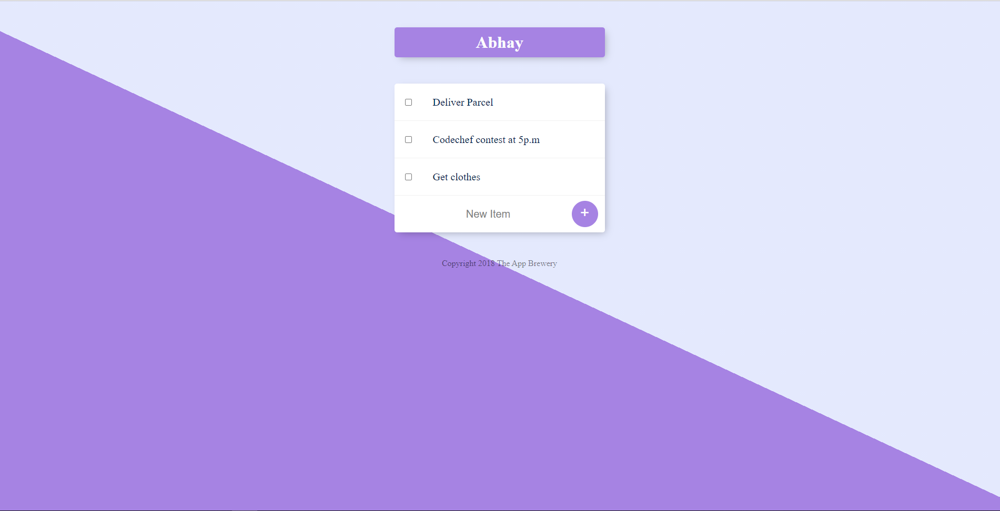
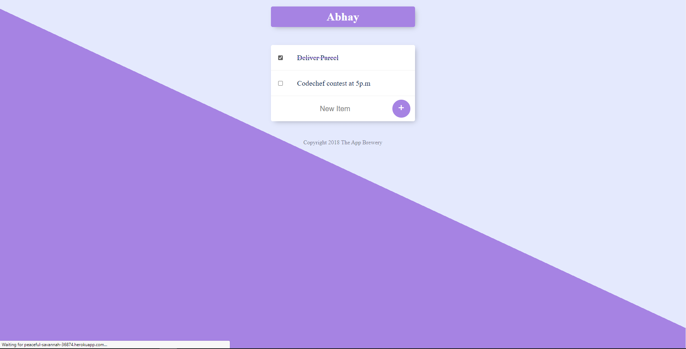

# To-do-list

Built this project as a part of my Web Development Bootcamp

This project was bootstrapped with [Create React App](https://github.com/facebook/create-react-app).

To Run the project: cd to project folder and type npm start and npm run.
<ul>
<li>
  <li>This is hosted online in heroku
 <li>Database is hosted on mongodb atlas
 <li>Create your own personalized to-do-list by adding /listname in the url.
</ul>
